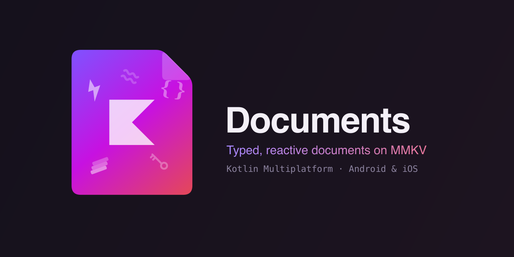

<div align="center">
  
</div>

[](https://github.com/nomemmurrakh/documents/actions/workflows/gradle.yml)
[](LICENSE)
[](https://kotlinlang.org)
[](https://documents.nomemmurrakh.com/platform-support.html)

A document-oriented Kotlin Multiplatform storage library backed by
[MMKV](https://github.com/Tencent/MMKV). Define a data class, treat it as a document, and get
typed reads, copy-style updates, and `Flow` reactivity.

```kotlin
@Serializable
data class Note(val title: String = "", val body: String = "", val done: Boolean = false)

val note = Documents.document<Note>("note-1")   // one call, you have a document

note.set(Note(title = "Pick up milk", body = "2%, not whole"))
note.update(Note::done, true)   // one field, no read
note.flow().collect { editor.render(it) }   // the editor reacts to every write
```

That's the whole story. No schema, no DAO, no `MMKV.initialize`, no serialization plumbing.

### 📖 [Read the full documentation →](https://documents.nomemmurrakh.com)

Installation, quick start, guides, use cases, concepts, benchmarks, and the full API reference all
live there.

---

## Platform support

| Platform | Status | Storage engine |
| -------- | :----: | -------------- |
| Android  | ✅ | MMKV |
| iOS — `arm64` + `simulatorArm64` | ✅ | MMKV (via CocoaPods) |

One public API across the board — it all lives in `commonMain`. MMKV is bound on Apple targets
through the Kotlin CocoaPods plugin, and the library owns MMKV initialization on both platforms,
so consumers never lift a finger.

## Try the sample

A runnable Android sample lives in [`sample/android/`](sample/android/) — a tiny Compose settings screen wired to
a single `Documents` document, with buttons that flip the theme and bump a launch counter, both
persisting instantly. Clone, run, tap. 👀

## License

See [LICENSE](LICENSE).

---

If you find `Documents` useful, consider giving the repo a ⭐ — it helps others discover it.
